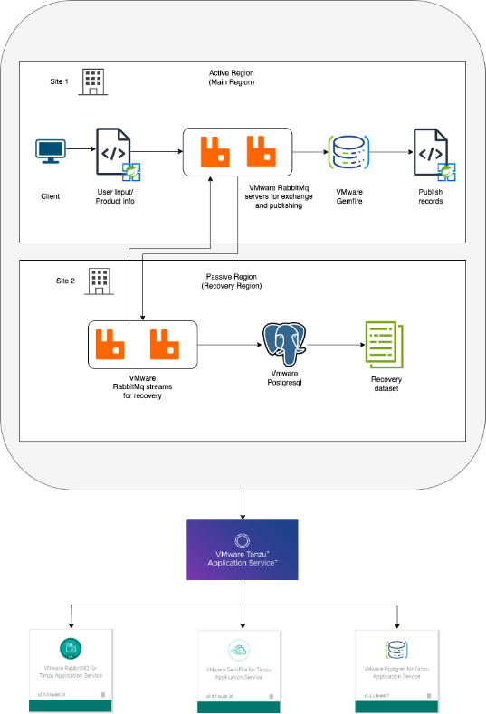
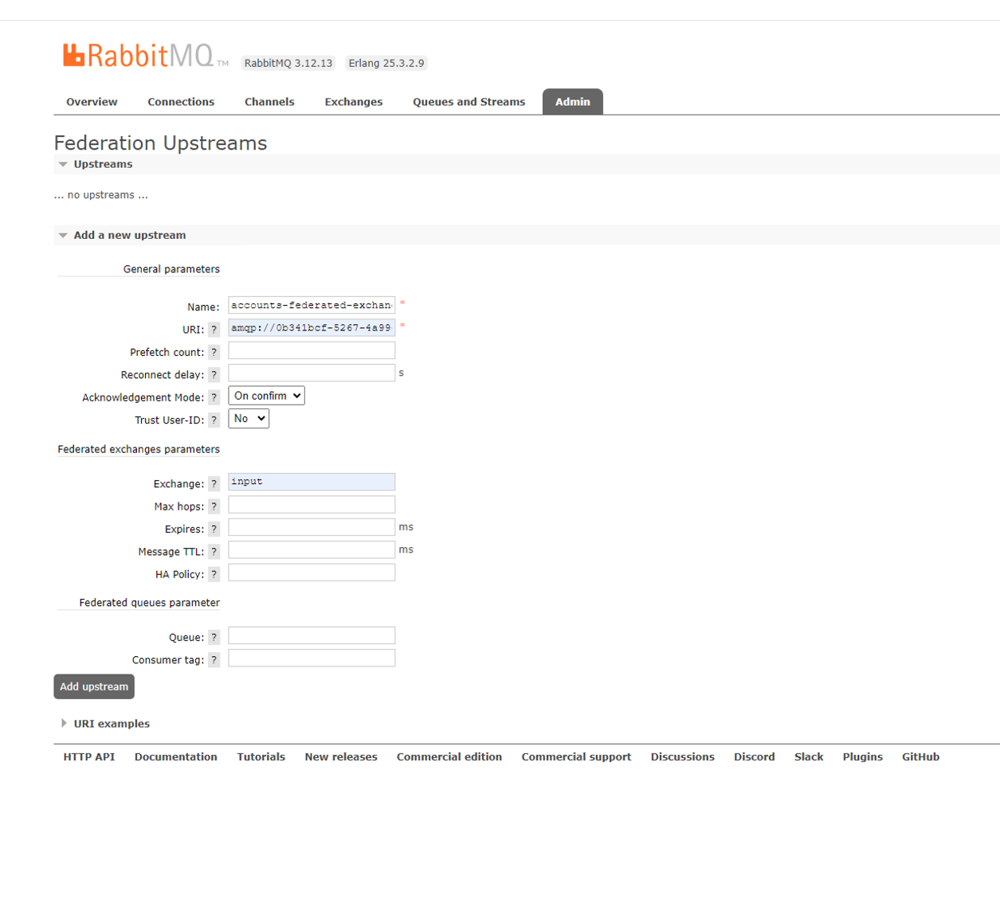
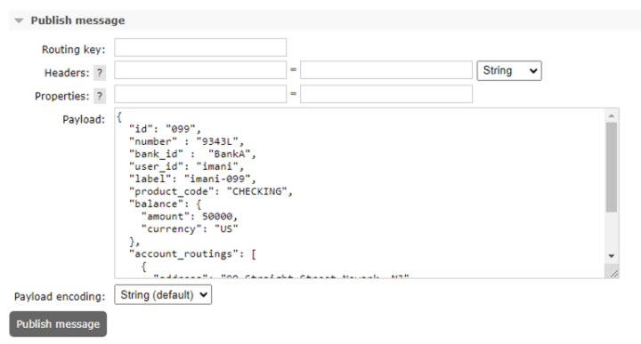
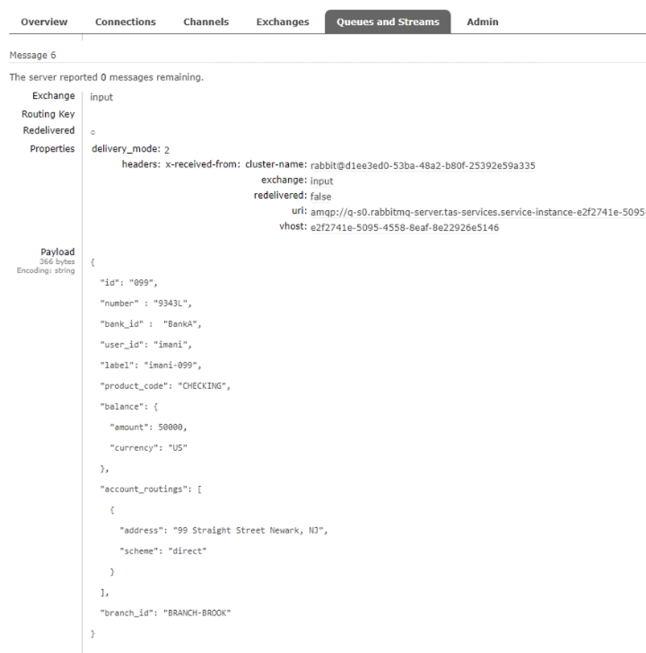

# Deploying Multi-Site Spring Application using TAS with Tanzu Data

A multi-site application operates seamlessly across multiple locations, ensuring centralised management, consistency, and scalability. One of the critical aspects of multi-site applications is their robust data replication and restore capabilities, which are essential for minimizing downtime and maintaining operations continuity.

In critical scenarios like banking, retail chains, healthcare networks, and government agencies, multi-site applications equipped with Tanzu Data can be widely used to restore data quickly in case of system failures and disruptions. It ensures efficient operations and robust data recovery mechanisms to prevent production delays. It helps in replicating and restoring data in case of network outages and rapid recovery to maintain public services.

The use case covered in this document demonstrates syncing big account information between two sites by enabling communication using VMware Tanzu Data Services. This solution workbook is using Tanzu Data Services such as Tanzu RabbitMQ, Tanzu GemFire, Tanzu Postgres, and Tanzu Application Service (informally known as TAS).

## Supported Component Matrix

The validated bill of materials to install Tanzu Data Services in multi-site environments.

| **Software Components**         | **Version**    |
| ------------------------------- | -------------- |
| Tanzu Application Service (TAS) | v2.11.45       |
| VMware RabbitMQ                 | v2.3.3-build.5 |
| VMware GemFire                  | v2.0.3-build.4 |
| VMware Postgres                 | v1.1.2-build.6 |

## Prerequisities

Two regions/sites (active and passive) are required for this use case.

> **Note** The scope of this document is limited to configuring replication between active and passive sites using Tanzu Data Services.

### Region 1 (Active Region)

- Region 1 is the cloud-native Spring application.
- It is the main region where the applications and services exist. Also, the event streaming across various Tanzu Data Services happens from this region.
- It performs operations like creating bank accounts and generating account IDs. It also lists all the accounts opened in a particular bank using the bank ID.
- The application receives User/bank details, sends them to RabbitMQ servers for exchange and publishes them to Tanzu GemFire for cache management.

### Region 2 (Passive Region)

- Region 2 is the .NET Steeltoe application.
- The passive region replicates the active region and is mainly used for achieving resiliency and data restoration.
- RabbitMQ Servers (maintain stream of data in region 1), maintain global records for backup and recovery using Postgres.

## Tanzu Data Services

Tanzu Data Services provides robust disaster recovery (DR) solutions through several key features:

- **Automated Backups and Recovery**:
  Tanzu Data Services automate the backup processes, ensuring that data is regularly and consistently backed up. This reduces the risk of data loss and ensures that a recent copy of data is always available for recovery.

- **Replication**:
  Data is often replicated across multiple geographic locations. This geographic redundancy ensures that even if one location experiences a failure or disaster, the data is still available from another location.

- **High Availability (HA)**:
  Tanzu Data Services are built with high availability in mind. This includes features like automatic failover, where the system can switch to a backup instance if the primary instance fails.

By incorporating these features, Tanzu Data Services offer a comprehensive and reliable disaster recovery solution that enhances overall efficiency and service quality for organizations across various sectors.

### Tanzu RabbitMQ

Tanzu RabbitMQ will exist in both Region 1 and Region 2. It can move, exchange and publish data between multiple regions to ensure data is seamlessly replicated for data recovery, ensuring no data loss even in case of any failovers.

### Tanzu GemFire

Tanzu GemFire is significant for achieving low-latency in-memory data access.

### Tanzu Postgress

Tanzu Postgres establishes dedicated instances of Postgres databases and supports distributed high-availability (HA) systems.

## Tanzu Application Service

Deploying a multi-site application integrated with VMware Tanzu Data on Tanzu Application Service (TAS) ensures high availability and effective disaster recovery for applications through several key features ensuring business continuity, and reliable service with robust disaster recovery capabilities.

## Architecture



## Deploy the multi-site Spring and .NET application using Tanzu Data Services on TAS

1. Install the **Tanzu Data tiles** on TAS. This will install **Tanzu RabbitMQ, Tanzu GemFire** and **Taznu Postgres** automatically.

2. Create services for **Tanzu RabbitMQ**, **Tanzu Gemfire** and **Tanzu Postgres**, and validate service status.

   <!-- /* cSpell:disable */ -->

   ```yaml
   cf create-service postgres on-demand-postgres-db bank-postgres

   cf create-service p-cloudcache extra-small bank-gemfire

   cf create-service p.rabbitmq on-demand-plan bank-rabbit

   cf create-service p.rabbitmq on-demand-plan bank-rabbit-site2
   ```

   <!-- /* cSpell:enable */ -->

3. Then configure **GemFire**:

   - Set the `settings.xml` file for GemFire:

     <!-- /* cSpell:disable */ -->

     ```yaml
     <settings>
     <servers>
     <server>
     <id>gemfire-release-repo</id>
     <username>your-username</username>
     <password>your-password</password>
     </server>
     <server>
     <id>gemfire-repository</id>
     <username>your-username</username>
     <password>your-password</password>
     </server>
     <server>
     <id>gitlab-maven</id>
     <username>your-username</username>
     <password>your-password</password>
     <configuration>
     <authenticationInfo>
     <userName>your-username</userName>
     <password>your-password</password>
     </authenticationInfo>
     </configuration>
     </server>
     </servers>
     </settings>
     ```

     <!-- /* cSpell:enable */ -->

   - Create the service key and get service account details:

     <!-- /* cSpell:disable */ -->

     ```yaml
     // create service key with name 'bank-gemfire-key'

     cf create-service-key bank-gemfire bank-gemfire-key

     // get service account details

     cf service-key bank-gemfire bank-gemfire-key
     ```

     <!-- /* cSpell:enable */ -->

   - Connect to the cluster by running the below command in the `gfsh` terminal. Provide the username and password from the service account details:

     <!-- /* cSpell:disable */ -->

     ```yaml
     // use the values received from the service account details

     connect --url=<url-value> --user=<username> --password=<password> --skip-ssl-validation
     ```

     <!-- /* cSpell:enable */ -->

   - Create a region for GemFire using the `gfsh` terminal:

     <!-- /* cSpell:enable */ -->

     ```yaml
     create region --name=BankAccount --type=PARTITION
     ```

     <!-- /* cSpell:enable */ -->

4. Deploy **TAS (Java Application)** on Region 1:

   - Generate the jar files for the Java application:

     <!-- /* cSpell:enable */ -->

     ```yaml
     mvn package
     ```

     <!-- /* cSpell:enable */ -->

     This command compiles the code, runs tests, and packages the compiled code into a distributable format, such as a JAR (Java Archive) located in the `target` directory of the project.

   - Write manifest files for the required Java applications. For example, manifest for bank-account-api-service (`bank-account-api-service-manifest.yaml`):

      <!-- /* cSpell:enable */ -->

     ```yaml
     applications:
       - name: bank-account-api-service
         memory: 1G
         random-route: true
         log-rate-limit-per-second: -1
         env:
           JBP_CONFIG_OPEN_JDK_JRE: "{ jre: { version: 17.+}}"
           SPRING_PROFILES_ACTIVE: "gemfire"
           spring.data.gemfire.security.username: <username>
           spring.data.gemfire.security.password: <password>
           spring.data.gemfire.pool.default.locators: <locators-value>
     ```

      <!-- /* cSpell:enable */ -->

     Manifest for bank-account-sink (bank-account-sink-manifest.yaml)

      <!-- /* cSpell:enable */ -->

     ```yaml
     applications:
       - name: bank-account-sink
         memory: 1G
         random-route: true
         log-rate-limit-per-second: -1
         services:
           - bank-gemfire
           - bank-rabbit
         env:
           JBP_CONFIG_OPEN_JDK_JRE: "{ jre: { version: 17.+}}"
           SPRING_PROFILES_ACTIVE: "gemfire"
     ```

      <!-- /* cSpell:enable */ -->

   - Perform a cf push for Region 1 application: `bank-account-api-service and bank-account-sink`:

     <!-- /* cSpell:enable */ -->

     ```yaml
     // perform cf push by providing the manifests and jar files of the respective application

     // bank-account-api-service

     cf push bank-account-api-service -f bank-account-api-service-manifest.yaml -p bank-account-api-service-0.0.1-SNAPSHOT.jar

     // bank-account-sink

     cf push bank-account-sink -f bank-account-sink-manifest.yaml -p bank-account-sink-0.0.2-SNAPSHOT.jar
     ```

     <!-- /* cSpell:enable */ -->

   - Validate the status of the deployed apps:

     <!-- /* cSpell:enable */ -->

     ```yaml
     // it will reflect the names and status of the pushed apps

     cf apps
     ```

     <!-- /* cSpell:enable */ -->

5. Deploy **TAS (.NET and Steeltoe Application)** on Region 2:

   - Publish .NET:

     <!-- /* cSpell:enable */ -->

     ```yaml
     // cd into the folder where the .NET application is present

     // run the dotnet publish command

     dotnet publish -r linux-x64 -f net6.0
     ```

     <!-- /* cSpell:enable */ -->

     The above step prepares the application for deployment by compiling the code and copying all necessary files (assemblies, dependencies, and configuration files) to a publish folder. The output file is a directory containing the executable and all required files to run the application on the system.

   - Write the manifest files for the required .NET applications. Manifest for global-accounts-service-api (`manifest.yaml`):

     <!-- /* cSpell:enable */ -->

     ```yaml
     applications:
       - name: global-accounts-service-api
         memory: 1G
         random-route: true
         log-rate-limit-per-second: -1
         services:
           - bank-postgres
     ```

     <!-- /* cSpell:enable */ -->

   - Manifest for global-accounts-streaming-consumer (`manifest.yaml`)

     <!-- /* cSpell:enable */ -->

     ```yaml
     applications:
       - name: global-accounts-streaming-consumer
         memory: 1G
         random-route: true
         log-rate-limit-per-second: -1
         services:
           - bank-postgres
           - bank-rabbit
     ```

     <!-- /* cSpell:enable */ -->

   - Perform a cf push for Region 2 application: `global-accounts-service-api` and `global-accounts-streaming-consumer`

      <!-- /* cSpell:enable */ -->

     ```yaml
     // perform cf push by providing the buildpack and dotnet publish files of the respective application

     // global-accounts-service-api

     cf push global-accounts-service-api -p bin/Debug/net6.0/linux-x64/publish/ -b dotnet\_core\_buildpack

     // global-accounts-streaming-consumer

     cf push global-accounts-service-api -p bin/Debug/net6.0/linux-x64/publish/ -b dotnet\_core\_buildpack
     ```

      <!-- /* cSpell:enable */ -->

   - Validate the status of the deployed apps.

     <!-- /* cSpell:enable */ -->

     ```yaml
     // it will reflect the names and status of the pushed apps

     cf apps
     ```

     <!-- /* cSpell:enable */ -->

## Add Tanzu Postgres Connection String for the Application

When the Postgres service is bound to the application, the `VCAP_APPLICATION` and `VCAP_SERVICES` variables become available in the container environment.

The application developer can use the following environment variables from `VCAP_SERVICES` to create a Postgres connection URI- host, database, username, and password.

## Configure Tanzu RabbitMQ Servers using Federated Exchange

Configure Tanzu RabbitMQ Servers present in different regions to communicate with each other using Federated Exchanges.

Federation exchange is a mechanism that allows a flow of messages through an exchange in one location (upstream) to be replicated to exchanges in other locations (downstream).

**Upstream Server:** This is the primary system where the original messages are generated and published.

**Downstream Server:** This is the secondary system responsible for transmitting the messages. It handles the federation exchange and queues the messages for further processing. Additionally, the connection to the upstream server is established and configured within this system.

1. Login to Server 2 of RabbitMQ.

   The username, passwords, dashboard URL and other fields such as URI can be fetched using-

    <!-- /* cSpell:enable */ -->

   ```yaml
   cf env <app\_name>

   The values can be found under VCAP_SERVICES under rabbitmq field.
   ```

    <!-- /* cSpell:enable */ -->

2. Navigate to **Admin** > **Federation Upstreams** > Add a new upstream.
3. Provide the values as given below and submit them using the **Add upstream** button:
   - **Name** - Provide a name of your choice.
   - **URI** - Provide the URI of RabbitMQ from Region 1.
   - **Acknowledge Mode** - On confirm
   - **Exchange** - the name of the Exchange in Region 1 of RabbitMQ (check under the **Exchanges** tab). You can leave the other fields as it is.

   

4. Add Policy by navigating to **Admin** > **Policies** > Add/update a policy:
   - **Name** - Add the name of the policy as per your choice.
   - **Pattern** - name of exchange in Region 1 of RabbitMQ.
   - **Apply to** - Exchanges and Queues
   - **Definition** - Specify the key as **federated-upstream-set** and value as **all**. You can leave other fields as it is and click the **Add/update policy** button.

   

5. Create an Exchange in Region 2 of RabbitMQ with the same name as present in Region 1.
   Navigate to **Exchanges** and Add a new exchange.
   - **Name** - Name of the exchange (keep it the same as the one present in Region 1).
   - **Type** - topic
   - **Durability** - Durable

   

6. Now check the Federation status. It should be green and in a running state.

7. Create Binding.
   In Region 1, navigate to **Exchanges** and Select Bindings.

   - **To queue** - Name of the exchange.
   - **Routing key** - ‘#’

     Click **Bind** to submit.

8. Now the user can publish messages from Region 1 and the data will be replicated in Region 2 of RabbitMQ automatically.

   - In Region 1 of RabbitMQ, navigate to **Exchanges** > **Publish Message**.

   - Add the Payload value and click the **Publish message** button.

   

9. In Region 2 of RabbitMQ, navigate to **Queues and Streams** > **Get messages**.

   

   The data replication will be successful and you can view the message published from Region 1 of RabbitMQ in Region 2 of RabbitMQ.

## Conclusion

For broadcasting messages from one region to another, RabbitMQ ensures an instant replica for widespread accessibility. This leverages cross-site messaging within a distributed system.

This helps in solving challenges such as, establishing and maintaining communication between multiple RabbitMQ clusters in various data centres.

Tanzu GemFire acts as a low-latency in-memory caching database.

This implementation for data transfer guarantees systematic and automated message replication. It helps the client to achieve reliable multi-site data transfer without manual intervention.

This also demonstrates how applications written in different languages can easily be deployed on TAS, and communication and data processing can be enabled using Tanzu Data.
